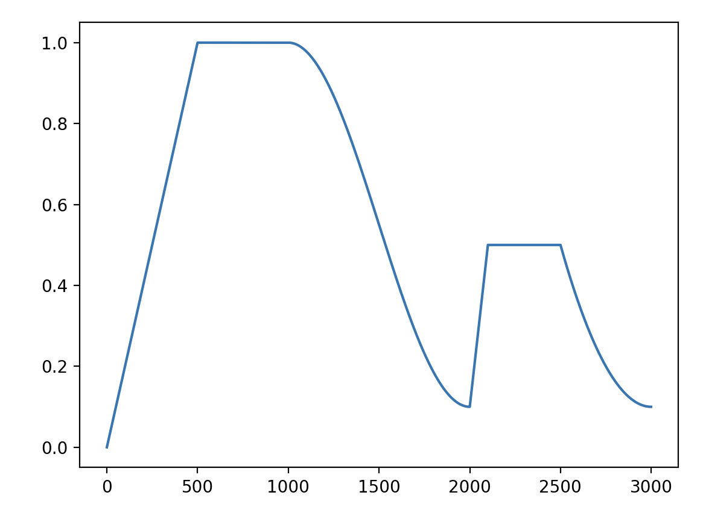
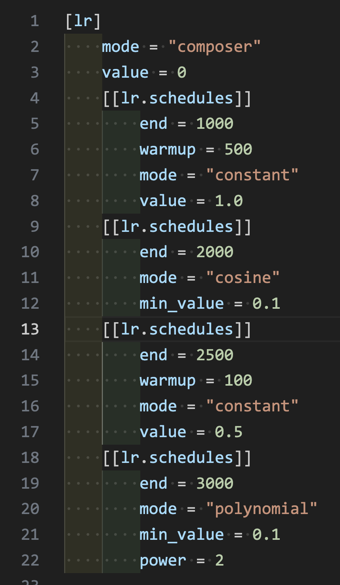

# AnySchedule

A composer tool for custom complex scheduler. (Such as WSD lr scheduler or more)

It is designed for scheduler for all hyperparameter in optimizer. (So schedule for weight decay or more hyper parameters is possible)

## Example

A simple example of "Multi-WSD" lr scheduler

|  |  |
| ---------------------------------------------- | ---------------------------------------------- |
